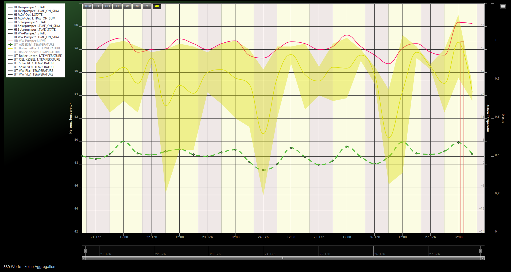
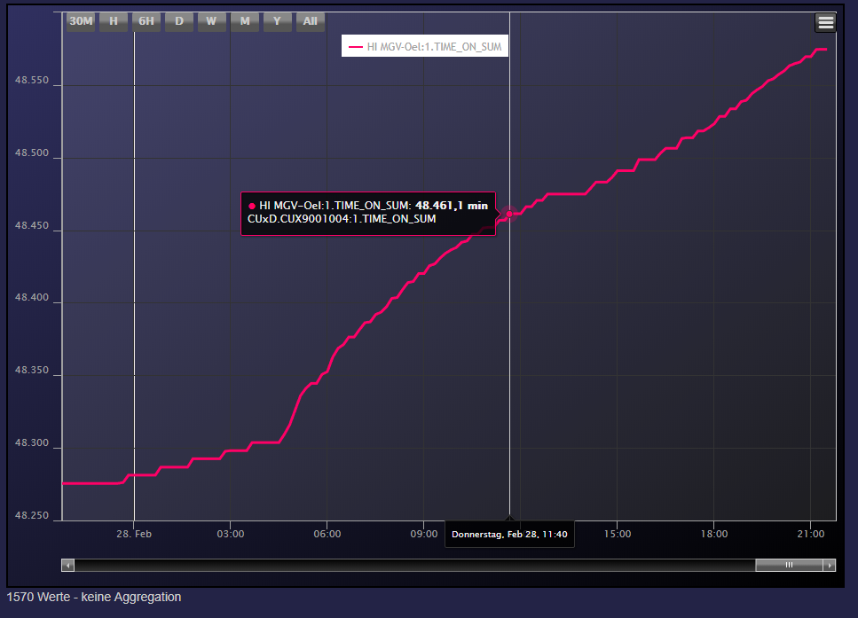
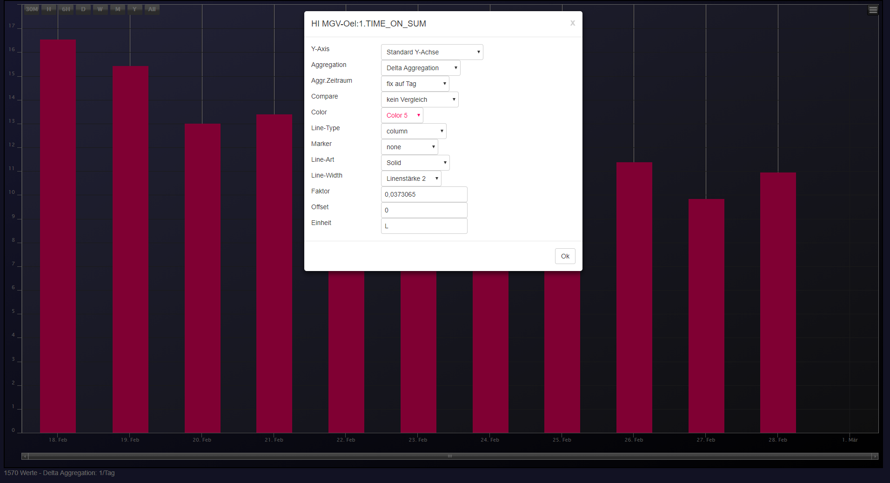
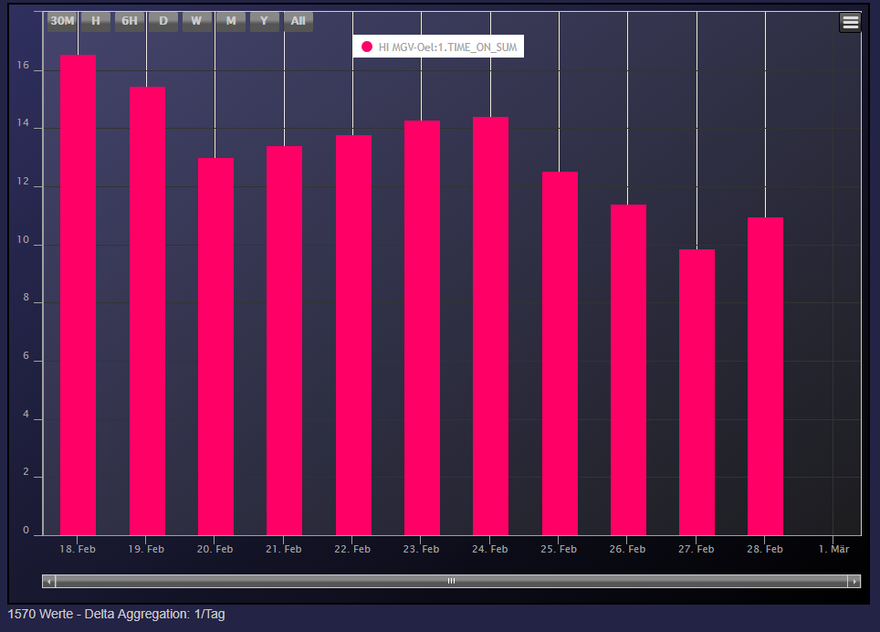
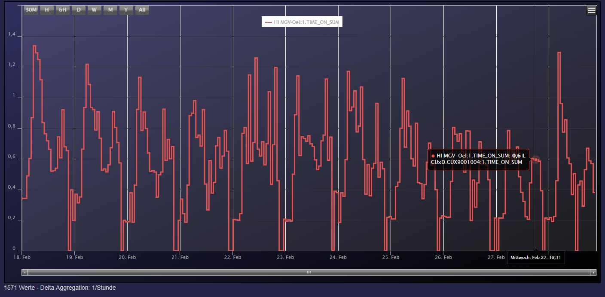
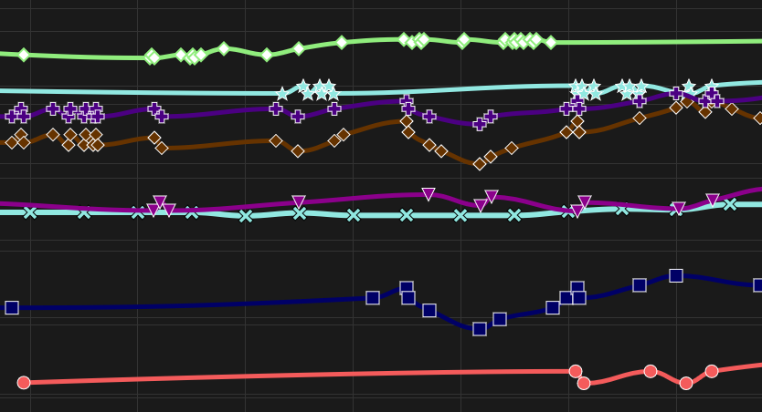
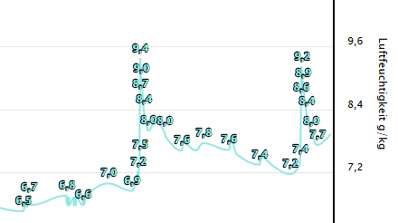

# CCU-Historian-HC  
Add HighChart to [CCU-Historian](https://github.com/mdzio/ccu-historian)  
This project combine interactive charts with the database of CCU-Historian. All can be done in one page.  

# Wiki

More Information about following point are available in the [Wiki](https://github.com/wakr70/CCU-Historian-HC/wiki) 
* Installation
* Parameter
* Examples

# Some Screens
11 axis are at the moment build in automatic. % percentage (0-100%), state (0 or 1) and all others.  

 
Add new themes: dark-green, avocado, dark-blue, dark-unica, gray, grid-light, grid, skies, sunset
 

Example for CUxD.SUM_ON_TIME where we get minutes:

Some with Delta Aggregation and Daily Aggregation additional factor 0.0373065 for L and new Unit L, here the settings:

and the outcome:

Same with aggregation time Fix to hour:

Some possible markers:  

Datalabels are now also possible, could enalbed with 2 under Popup->Settings:  

